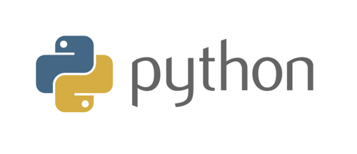
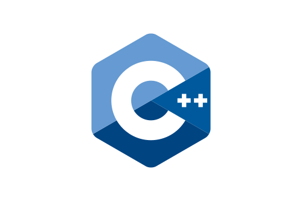

  
  <h1>Hello World, Here I Am</h1>

I am a beginner programmer, specialized in back-end programming with foundations in front-end programming. Currently, I am pursuing a university degree in software development. In this profile, you will find publicly available software that I have used to learn various programming fundamentals. You will also find projects that I have used to learn different programming languages and, in turn, projects that I have used to test my abilities. I will regularly be uploading computer-related content to the YouTube channel linked in this profile.

## PROGRAMING LANGUAGES:
### PYTHON:

### c++:

### java:

